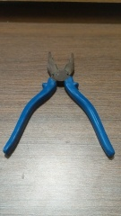
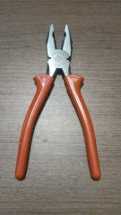

# Keypoint detection training using Tensorflow Object detection API

## Introduction

Most of the keypoint detection model and repositories are trained on [COCO](https://cocodataset.org/#keypoints-2020) or [MPII](http://human-pose.mpi-inf.mpg.de/#overview) human pose dataset or facial keypoints. There were no tangible guide to train a keypoint detection model on custom dataset other than human pose or facial keypoints.  
And hence this repository will primarily focus on keypoint detection training on custom dataset using [Tensorflow object detection API](https://github.com/tensorflow/models/tree/master/research/object_detection). Here we have used a combination of [Centernet](https://arxiv.org/abs/1904.07850)-[hourglass](https://arxiv.org/abs/1603.06937) network therefore the model can provide both bounding boxes and keypoint data as an output during inference.  
We will be using the transfer learning technique on [centernet-hourglass104](http://download.tensorflow.org/models/object_detection/tf2/20200711/centernet_hg104_512x512_kpts_coco17_tpu-32.tar.gz) pre-trained model trained on coco dataset to speed-up the training process. 

## Table of contents

- [Preparing dataset](#preparing-dataset)
  - [Data collection](#data-collection)
  - [Annotation](#annotation)
  - [Processing dataset](#processing-dataset)
- [Model preparation](#model-preparation)
  - [Pretrained model](#pretrained-model)
  - [Parameter changes in config file](#parameter-changes-in-config-file)
  - [Creating label map](#creating-label-map)
- [Training](#training)
- [Inference](#inference)


## Preparing dataset

Create a folder structure similar to this order  
```
Custom-keypoint-detection
|_ dataset
    |_ images (folder to place all the images)
    |_ annotations (folder to place the annotation file)
    |_ tfrecord (folder to place tfrecord)
```
Our intention in this project is to detect cutting plier and it's 5 keypoints. Basically you can replace it with any object you need to detect.

### Data collection

Collect all your images and place it into your ```dataset/images``` folder. Make sure all the images are in same format, preferably .jpg/jpeg.






### Annotation

The TF2 object detection pipeline requires the dataset for centernet-hourglass network to be annotated on [coco data format](https://cocodataset.org/#format-data) as it's pretrained model is initially trained on COCO dataset.  
I have used [coco-annotator](https://github.com/jsbroks/coco-annotator), a web-based annotation tool that let's you annotate bounding boxes, keypoints, etc which also allows us to automatically download the annotations in coco data format. The [setup and installtion](https://github.com/jsbroks/coco-annotator/wiki/Getting-Started) using docker is super easy, where you can follow these steps to do so.

Run ```docker-compose up``` on terminal from the coco_annotator project directory. Once it's fired up, open ```http://localhost:5000``` on your web browser to go to COCO annotator web interface.

#### Create dataset

Go to *Datasets* tab and create a new dataset. Give a *dataset name* and click **Create Dataset**.  

  

It will automatically create a folder inside ```coco-annotator/datasets/(dataset_name)```. Now copy all the images from ```Custom-keypoint-detection/dataset/images``` to ```coco-annotator/datasets/(dataset_name)```. This will automatically import all the images into the coco-annotator tool.  

#### Create categories

Next step is to create the **_categories (labels)_** for our dataset to annotate. We create categories only for the objects that needs to be detected using bounding box. We won't create separate categories for keypoints, it will be a subset of the object itself.  
Link **_categories_** to the dataset by the **_Edit_** option.

  

#### Image annotation

Move to ```Datasets``` tab and click on the images to start annotating. Draw the bounding box first and press ```right arrow``` on the keyboard to annotate keypoints. Follow the same keypoints order while annotating which shows on the right side panel. 


After annotating the required images, download the annotation data through ```Datasets -> Download COCO```. All the annotation data will be saved and downloaded as a ```(dataset_name).json``` file.


You can find the [annotation file](dataset/annotations/Plier%20keypoint.json) for our dataset in ```dataset/annotations/``` folder. By looking at the data structure in annotation file you will get any idea how to prepare your own dataset in coco format.

### Processing dataset

As you can see we have all the images annotated and saved in a file. But for training, we need two type of dataset namely, training and validation data. So, in order to prepare your dataset for training, we need to split the dataset into set. 

```
$ python cocosplit.py -h
usage: cocosplit.py [-h] -s SPLIT [--having-annotations]
                    coco_annotations train test

Splits COCO annotations file into training and test sets.

positional arguments:
  coco_annotations      Path to COCO annotations file.
  train                 Where to store COCO training annotations
  test                  Where to store COCO test annotations

optional arguments:
  -h, --help            show this help message and exit
  -s SPLIT              A percentage of a split; a number in (0, 1)
  --having-annotations  Ignore all images without annotations. Keep only these
                        with at least one annotation
```
```
python split_coco_dataset.py -s 0.8  dataset/annotations/Plier keypoint.json 
            dataset/annotations/train_data.json dataset/annotations/validation_data.json
```

This script will split the data with 80% into training data and 20% into validation data.  
Thanks to [cocosplit repo from akarazniewicz](https://github.com/akarazniewicz/cocosplit), most part of the script is inspired from his work and just made few adjustments to it.


## Model preparation

### Pretrained model

Download the [centernet-hourglass104 keypoints 512x512](http://download.tensorflow.org/models/object_detection/tf2/20200711/centernet_hg104_512x512_kpts_coco17_tpu-32.tar.gz) pre-trained model from [TF2 model zoo](https://github.com/tensorflow/models/blob/master/research/object_detection/g3doc/tf2_detection_zoo.md). You can also use [centernet-hourglass104 keypoints 1024x1024](http://download.tensorflow.org/models/object_detection/tf2/20200711/centernet_hg104_1024x1024_kpts_coco17_tpu-32.tar.gz) pretrained model.  
Extract and place the pre-trained model inside the ```/pretrained_models``` folder. Your folder structure should look like this 
```
Custom-keypoint-detection
|_ dataset
    |_ images (folder to place all the images)
    |_ annotations (folder to place the annotation file)
    |_ tfrecord (folder to place tfrecord)
|_ pretrained_model
    |_ centernet_hg104_512x512_kpts_coco17_tpu-32
```


### Parameter changes in config file

### Creating label map

## Training

## Inference

### To-do's
